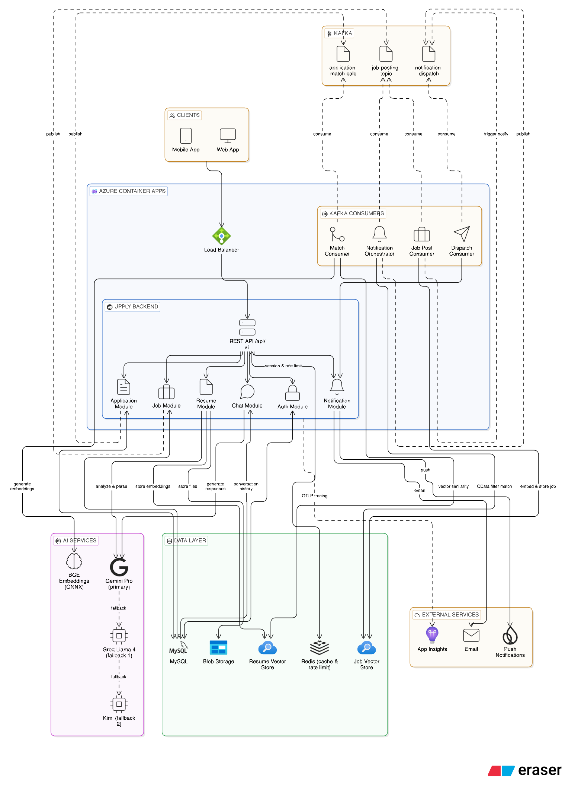

<div align="center">
  

  <h1>Upply Backend</h1>

  <p>
    AI-powered recruitment platform backend — intelligent job matching, resume analysis, and recruiter chat built on Spring Boot.
  </p>

  <p>
    <a href="https://deepwiki.com/upply-org/upply-backend" target="_blank">
      
    </a>
    
    
  </p>
</div>

---

## Overview

**Upply** is a modern AI-driven recruitment platform that connects job seekers with the right opportunities — and recruiters with the right candidates. The backend is a monolithic Spring Boot application designed with a clean modular structure and an event-driven core powered by Apache Kafka.

Key capabilities:
- **Smart Job Matching** — vector-similarity search matches candidates to jobs based on skills, not just keywords.
- **Resume Intelligence** — AI parses, analyses, and embeds uploaded resumes to power semantic search.
- **Recruiter AI Chat** — a RAG-based chat interface lets recruiters query candidate pools in natural language.
- **Full Application Lifecycle** — structured status transitions from submission through hire or rejection.
- **Omnichannel Notifications** — real-time push notifications (Firebase) and email updates at every step.

---

## System Architecture



The platform is deployed on **Azure Container Apps** behind a load balancer. The backend exposes a REST API at `/api/v1`.

The data layer consists of:
- **MySQL** — primary relational store
- **Azure Blob Storage** — resume file storage
- **Azure AI Search** — vector store for job & resume embeddings
- **Redis** — rate limiting and caching

---

## Features

### Authentication & Security
- JWT-based stateless authentication (access + refresh token flow)
- Account activation via email link

### Job Management
- Post, update, pause, and close job listings
- Filter jobs by type, seniority, model (onsite / hybrid / remote), location, and status
- Support for both internal jobs (apply via platform) and external jobs (link redirect)


### Application Lifecycle
- Apply to internal jobs with an uploaded resume
- Strict status-transition enforcement:
  `SUBMITTED → UNDER_REVIEW → SHORTLISTED → INTERVIEW → OFFERED → HIRED / REJECTED / WITHDRAWN`
- Automatic Kafka event publishing after each transition
- Resume download for recruiters
- Application summary — AI-generated summary to help recruiters quickly view candidate highlights before opening the full application
- Export applications to Excel (`.xlsx`)
- 
### AI Job Matching
- **BGE Small EN v1.5** (ONNX, runs locally) generates dense embeddings
- Job embeddings are stored in **Azure AI Search** on publish
- Candidate embeddings are built from their skill profiles
- Similarity search (`cosine`, threshold ≥ 0.6) surfaces the top-K matching jobs or candidates

### Resume Intelligence
- PDF resume upload stored in Azure Blob
- AI parses resume into structured sections (experience, skills, projects)
- Specialized resume feedback — AI analyzes resumes and provides actionable feedback tailored to the job requirements
- Embeddings stored in a dedicated vector index for recruiter RAG chat

### Recruiter AI Chat (RAG)
- Recruiter creates a chat session scoped to a specific job
- Questions are answered using **Gemini Flash** (primary LLM) with resume embeddings as context
- Streaming responses via Server-Sent Events (`text/event-stream`)
- Conversation history persisted in MySQL 
- LLM fallback chain: **Gemini Pro → Groq Llama 4 / Kimi**

### Notifications
- **Firebase Cloud Messaging** for real-time push notifications
- **SMTP / Gmail** for transactional emails with Thymeleaf HTML templates
- Notification orchestrator fans out events from Kafka to the appropriate channel(s)

### User Profile
- Skills, work experience, projects, and social links
- Multiple resume management per user
- Profile autofill — AI automatically extracts and fills user profile information from uploaded resumes

### Organization Management
- Recruiters are tied to organizations
- Jobs are scoped to organizations

---

## Tech Stack

| Layer | Technology |
|---|---|
| Language | Java 21 (Virtual Threads enabled) |
| Framework | Spring Boot 3.5.7 |
| AI / ML | Spring AI, BGE Small EN v1.5 (ONNX), Gemini Pro, Groq Llama 4, Kimi |
| Security | Spring Security, JWT (JJWT 0.11.5) |
| Database | MySQL 8.3, Spring Data JPA / Hibernate |
| Vector Store | Azure AI Search |
| File Storage | Azure Blob Storage |
| Messaging | Apache Kafka|
| Notifications | Firebase Admin SDK 9.2, Spring Mail |
| Caching | Redis (redis-stack) |
| Templating | Thymeleaf |
| Documentation | Springdoc OpenAPI (Swagger UI) 2.8.13 |
| Observability | Azure Application Insights, OpenTelemetry (OTLP), Micrometer |
| Build | Maven (wrapper included) |
| Containerization | Docker, Docker Compose |
| CI/CD | GitHub Actions |
| Deployment | Azure Container Apps |

---

## Project Structure

```
upply-backend/
├── src/main/java/com/upply/
│   ├── application/        # Job application lifecycle & match consumer
│   ├── auth/               # Registration, login, token refresh
│   ├── chat/               # Recruiter RAG chat sessions & streaming
│   ├── common/             # Shared DTOs, pagination helpers, enums
│   ├── config/             # Spring beans: Kafka, Security, AI, Azure …
│   ├── email/              # Email service & Thymeleaf templates
│   ├── exception/          # Global exception handler & custom exceptions
│   ├── job/                # Job CRUD, matching service, Excel export
│   ├── notification/       # Orchestrator, push service, dispatch consumer
│   ├── organization/       # Organization management
│   ├── profile/
│   │   ├── experience/     # Work experience
│   │   ├── project/        # Portfolio projects
│   │   ├── resume/         # Resume upload, parsing, Azure storage
│   │   ├── skill/          # Skill entity & management
│   │   └── socialLink/     # LinkedIn, GitHub, etc.
│   ├── security/           # JWT filter, UserDetails, security config
│   ├── token/              # Refresh / activation token management
│   ├── user/               # User entity & repository
│   ├── vector/             # Vector store index configuration
│   └── UpplyApplication.java
├── src/main/resources/
│   ├── application.yml     # Main configuration (reads from .env)
│   ├── aiven/              # Kafka SSL keystores / truststores
│   ├── prompts/            # AI prompt templates
│   └── templates/          # Thymeleaf email templates
├── scripts/
│   ├── create-chat-memory-table.sql   # DDL for AI chat memory table
│   └── create-chat-memory-table.sh
├── docs/
│   ├── system-arch.png
│   └── upply.jpg
├── Dockerfile
├── docker-compose.yml      # Local dev stack (MySQL, Redis, Kafka, Azurite …)
└── pom.xml
```

---

## Getting Started

### Prerequisites

| Tool | Version |
|---|---|
| JDK | 21+ |
| Maven | 3.9+ (or use `./mvnw`) |
| Docker & Docker Compose | Latest stable |

### Environment Variables

See `.env.example` for all required environment variables. Copy it to `.env` and fill in your values:

```
cp .env.example .env
```

### Running Locally

**1. Start the infrastructure services:**

```
docker compose up -d
```

This starts: MySQL · Redis · Kafka + Zookeeper · Azurite (Azure Storage emulator) · Kafka UI (`http://localhost:8090`).

**2. Create the AI chat memory table:**

```
./scripts/create-chat-memory-table.sh
```

Or run the SQL manually against your MySQL instance.

**3. Start the Spring Boot application:**

```
./mvnw spring-boot:run
```

The API will be available at: `http://localhost:8080/api/v1`

### Running with Docker

Build and run the full application container:

```
docker build -t upply-backend .
docker run --env-file .env -p 8080:8080 upply-backend
```

> The Dockerfile uses a two-stage build: Maven compiles and packages in the build stage; a slim JRE image runs the final artifact.

---

## API Documentation

Swagger UI is auto-generated by Springdoc OpenAPI and available at:

```
http://localhost:8080/api/v1/swagger-ui.html
```

OpenAPI JSON spec:

```
http://localhost:8080/api/v1/v3/api-docs
```

---

## CI/CD

Two GitHub Actions workflows are included:

| Workflow | Trigger | What it does |
|---|---|---|
| `push-pr.yml` | Push / PR to any branch | Builds the project and runs tests |
| `docker-publish.yml` | Push to `main` | Builds Docker image and pushes to DockerHub with `latest` and `<branch>-<sha>` tags |

Required GitHub secrets:

```
DOCKERHUB_USERNAME
DOCKERHUB_TOKEN
```

---

## Contributing

1. Fork the repository and create a feature branch from `main`.
2. Follow the existing package structure and naming conventions.
3. Add tests for new services under `src/test/`.
4. Open a Pull Request — the CI pipeline must pass before merging.

---

## License

This project is licensed under the terms found in the [LICENSE](LICENSE) file.

---

<div align="center">
  Built with ❤️ by the UPPLY Team
</div>